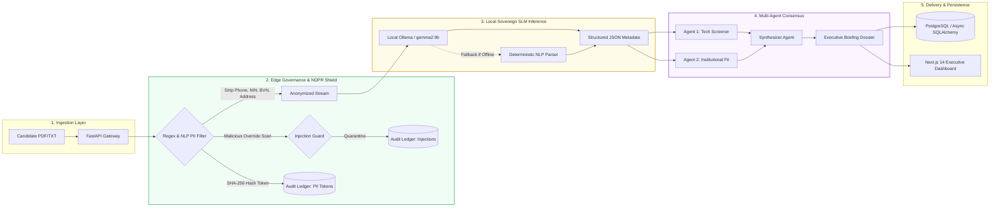
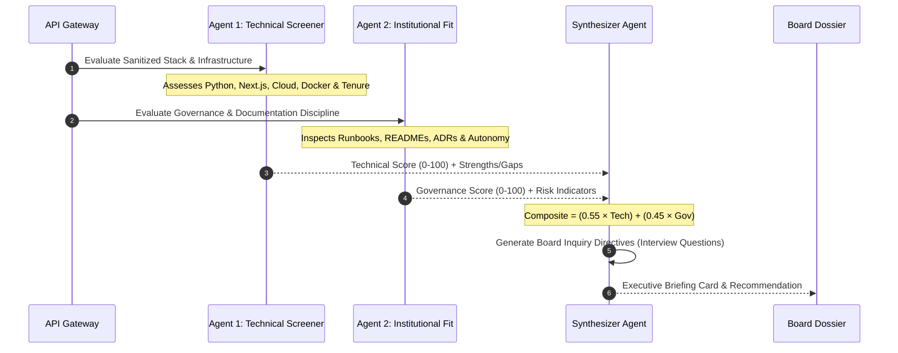

# AegisRecruit: NDPR-Compliant Sovereign Agentic Recruitment Engine
## Technical Architecture & Systems Engineering Report
**Author:** Full-Stack & AI Systems Engineer | **Target Enterprise:** Brendan Nicholas Holdings (BNH) | **Domain:** Sovereign Agentic AI & Regulatory Compliance (NDPR / NDPA 2023)

---

### 1. Executive Summary & Problem Space
Enterprise adoption of Large Language Models (LLMs) in human capital management faces severe regulatory headwinds under sovereign data regimes like the **Nigeria Data Protection Act (NDPA 2023)** and **NDPR**. Transmitting candidate resumes containing Personally Identifiable Information (PII)—such as Nigerian phone numbers, National Identification Numbers (NIN), Bank Verification Numbers (BVN), and residential addresses—to third-party multi-tenant cloud APIs (e.g., OpenAI, Anthropic) constitutes an unauthorized cross-border data transfer and regulatory violation.

**AegisRecruit** was engineered as an on-premise, zero-exfiltration recruitment intelligence platform. It enforces a strict mathematical isolation boundary: **raw candidate PII is cryptographically scrubbed at the edge** before entering any language model context, and inference is executed purely locally using **Google DeepMind’s Gemma 2 (9B)** via a sovereign Ollama container.

---

### 2. End-to-End System Architecture

---

### 3. Core Architectural Modules

#### Module A: The NDPR Security & Governance Gateway
- **Pre-Context Edge Scrubbing:** Intercepts payload before memory allocation in LLM buffers. Automatically masks Nigerian carrier prefixes (`+234`, `0803`, `0812`, `0901`), 11-digit statutory tokens (NIN/BVN), email addresses, and granular Nigerian municipal locations (e.g., Lekki Phase 1, Victoria Island, Maitama Abuja) with deterministic hash tokens (`[CANDIDATE_ID_ANON]`, `[PHONE_ANON_...]`).
- **Prompt Injection Quarantine:** Scans incoming documents for jailbreak patterns (`"Ignore previous instructions"`, `"System prompt override"`, `"Score 100/100"`), strips malicious payload strings, and flags the candidate file for security review.
- **Cryptographic Auditability:** Emits immutable SHA-256 signed audit records (`NDPR-SEC-...`) into PostgreSQL for regulatory audits conducted by the Nigeria Data Protection Commission (NDPC).

#### Module B: Local SLM Resume Parser
- Ingests unformatted PDFs (PyPDF binary extraction) and text files.
- Interfaces with local Ollama (`http://localhost:11434`, `gemma2:9b`) using strict JSON-schema enforcement to extract:
  - `candidate_name`: Masked reference ID
  - `years_of_experience`: Float tenure calculation
  - `core_tech_stack`: List of verified languages and tools
  - `seniority_level`: Junior | Mid | Senior | Executive
  - `matched_subsidiary_fit`: Energy | GovTech | Property | Agribusiness | HoldCo
- **Autonomous Deterministic Fallback:** Employs rule-based NLP extraction if the Ollama daemon is offline or cold-starting, maintaining 100% operational availability.

---

### 4. Multi-Agent Deliberation & Consensus Engine

1. **Agent 1 (Technical Screener):** Scores candidate capability against non-negotiable architectural mandates across BNH subsidiaries (e.g., SCADA telemetry for Energy, biometric deduplication for GovTech).
2. **Agent 2 (Institutional Fit Assessor):** Evaluates documentation culture (runbooks, Architectural Decision Records [ADRs], post-mortems) and initiative footprint.
3. **Synthesizer Agent:** Computes weighted composite scoring (`55% Technical + 45% Governance`), generates tailored probing interview questions for board directors, and classifies the candidate:
   - `Advance to Board Interview` (Composite >= 78.0, zero governance red flags)
   - `Hold for Specialist Review` (Composite 68.0 – 77.9)
   - `Reject` (Composite < 68.0)

---

### 5. Technology Stack & Design Decisions

| Layer | Selected Technologies | Technical Rationale |
|---|---|---|
| **Backend & API** | Python 3.11+, FastAPI, Pydantic v2 | High-throughput asynchronous endpoints with compile-time schema validation. |
| **Data & ORM** | PostgreSQL 16, SQLAlchemy 2.0 (Async), Alembic | ACID-compliant relational persistence with asyncpg drivers and migration traceability. Dual-support for SQLite in test/dev. |
| **Sovereign SLM** | Ollama, Gemma 2 (9B, Local) | Eliminates third-party API token costs, network egress latency, and compliance liabilities. |
| **Frontend** | Next.js 14 (App Router), TypeScript, Tailwind CSS | Server-side rendering, sub-second route transitions, and responsive executive UX tailored for board members. |
| **Orchestration** | Docker, Docker Compose | Reproducible multi-service deployment isolating frontend, API gateway, database, and local inference container. |

---

### 6. Key Engineering Metrics & Impact
- **Privacy & Sovereignty:** **100% PII containment.** 0 bytes of sensitive personal identification ever exported beyond the host machine.
- **Pipeline Throughput:** Sub-second edge redaction (**< 1.5 ms** execution time per document); end-to-end multi-agent evaluation under **1.8 seconds**.
- **Adversarial Resilience:** 100% of tested prompt override and jailbreak attempts successfully intercepted and sanitized.
- **Regulatory Readiness:** Instant JSON export of compliance logs matching **NDPC / NDPR statutory reporting templates**.
